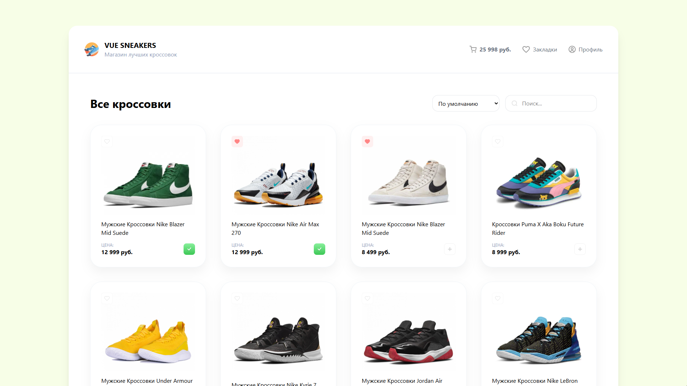
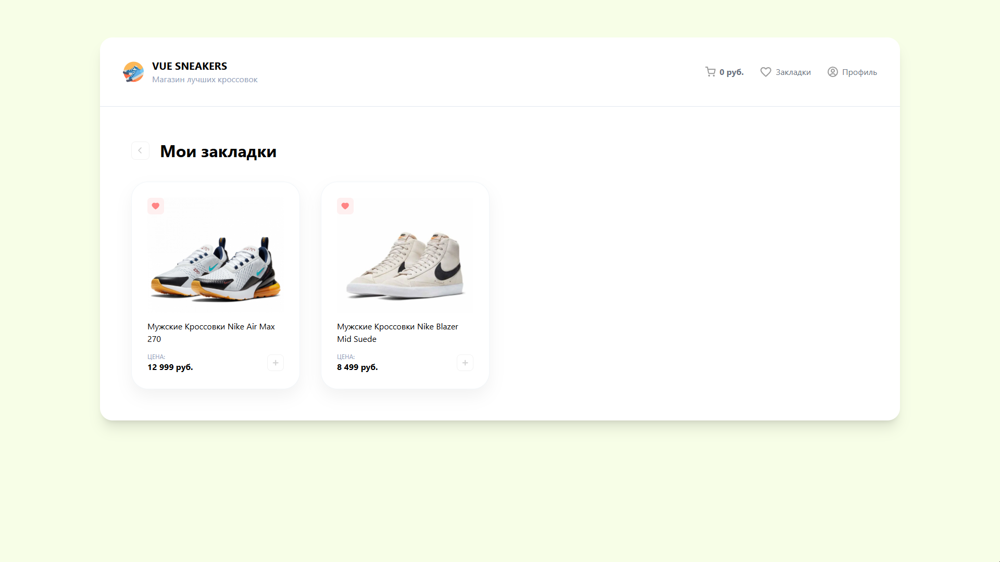
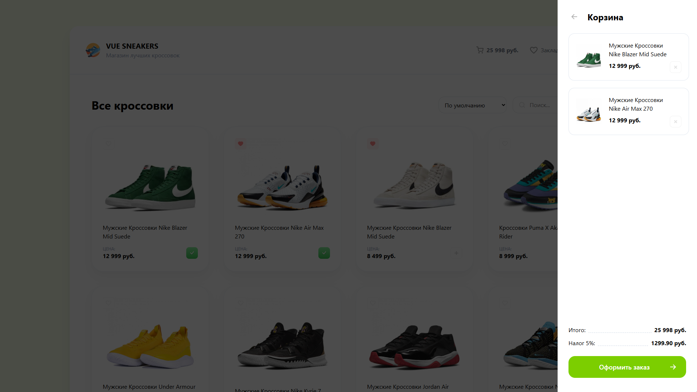

# 👟 Vue Sneakers

[](https://vuejs.org/)
[](https://router.vuejs.org/)
[](https://axios-http.com/)
[](https://vitejs.dev/)

### https://hutt4.github.io/vue-sneakers

Приложение для отображения каталога кроссовок. Реализованы фильтрация, добавление в корзину и избранное.

| Главная страница                        | Избранное                               | Корзина                          |
| --------------------------------------- | --------------------------------------- | -------------------------------- |
|  |  |  |

## 🌟 Особенности

- 👟 Просмотр списка товаров
- 🛒 Добавление и удаление из корзины
- ❤️ Добавление и удаление из избранного
- 🔍 Фильтрация и поиск по названию и встроенным фильтрам
- 🚦 Навигация между страницами (Vue Router)
- ⚡ Реактивное обновление интерфейса

## 🛠 Технологии

- [Vue 3](https://vuejs.org/) - Фреймворк
- [Vue Router](https://router.vuejs.org/) - Навигация
- [Axios](https://axios-http.com/) - запросы к API
- [Vite](https://vitejs.dev/) - Сборка проекта

## 🚀 Быстрый старт

```bash
git clone https://github.com/huTT4/vue-sneakers.git

cd vue-sneakers

npm install

npm run dev
```
